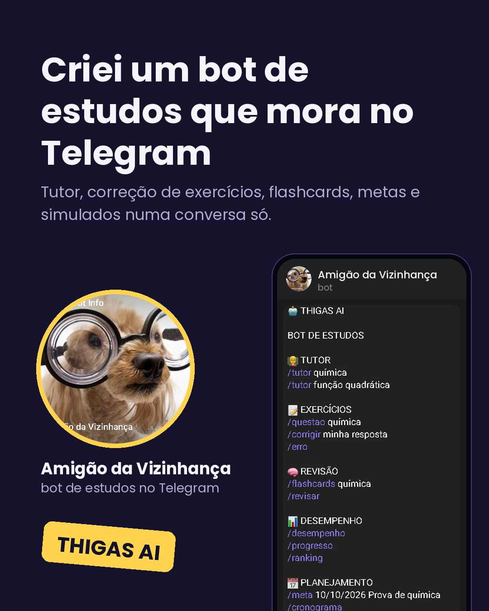
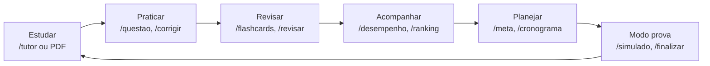
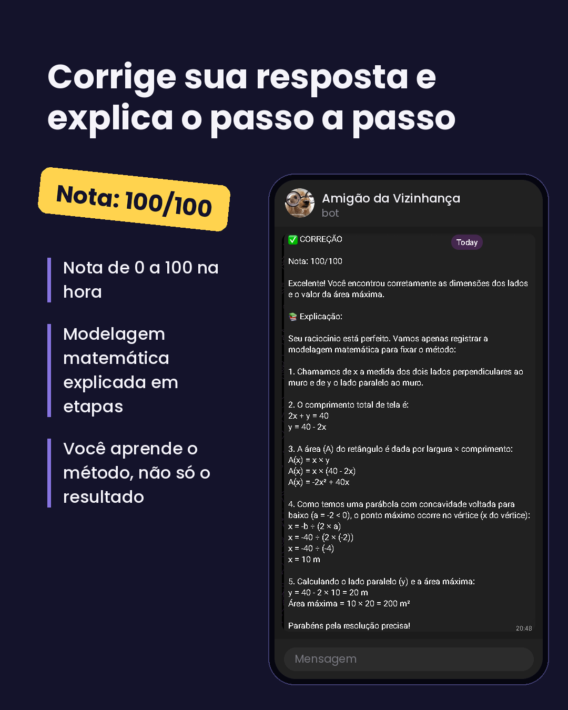
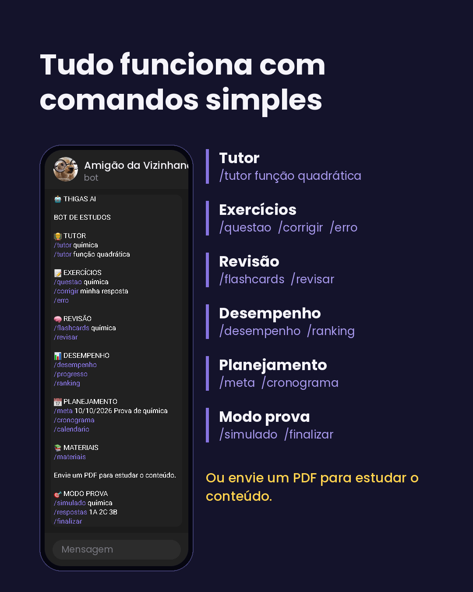
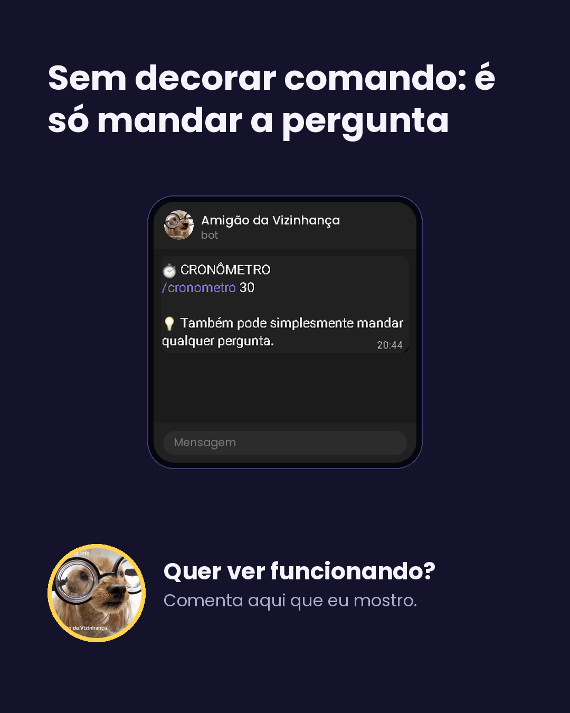
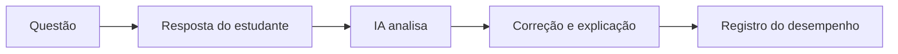
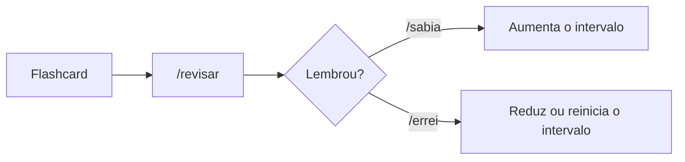
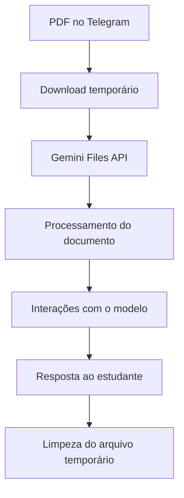
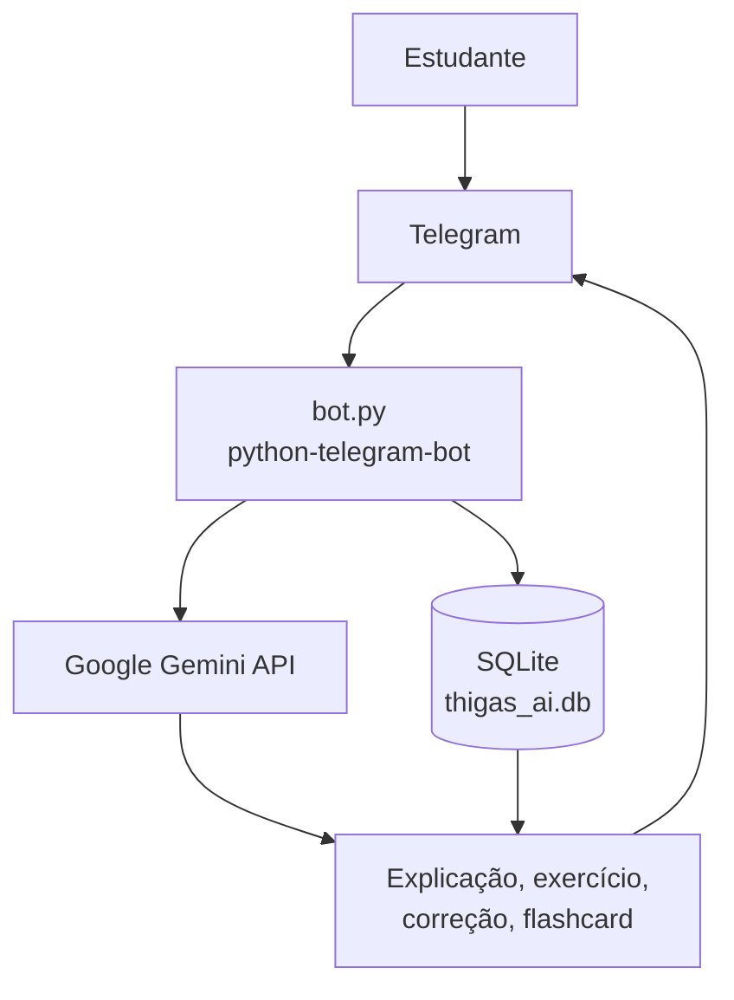

<div align="center">



# Ajudante123bot: Amigão da Vizinhança

**Tutor de estudos com IA para o Telegram: explicações, exercícios corrigidos, flashcards, metas e simulados numa conversa só.**

[](https://t.me/Ajudante123bot)


[Sobre](#sobre-o-projeto) | [Veja funcionando](#veja-funcionando) | [Comandos](#funcionalidades-e-comandos) | [Como funciona](#como-funciona) | [Instalação](#instalação) | [Roadmap](#roadmap)

</div>

---

## Sobre o projeto

O **Ajudante123bot** é um projeto pessoal de **Inteligência Artificial aplicada à educação (EdTech)**, feito em Python para o Telegram com a API do Google Gemini.

Em vez de apenas responder perguntas, ele reúne ferramentas para **aprender, praticar, revisar, planejar e acompanhar o desempenho** do estudante. Pelo Telegram, dá para:

- 👨‍🏫 receber explicações
- 📝 gerar exercícios
- ✅ corrigir respostas
- ❌ entender os próprios erros
- 🧠 criar e revisar flashcards, com revisão espaçada
- 📊 acompanhar desempenho, progresso e ranking
- 📅 criar metas e cronogramas
- 📚 trabalhar com materiais e PDFs
- 🎯 fazer simulados
- ⏱️ usar cronômetros
- 🤖 fazer perguntas livres para a IA

## Como a ideia surgiu

A ideia veio da necessidade de uma ferramenta de estudos mais completa que um simples chatbot. Normalmente o estudante precisa de várias ferramentas separadas:

```text
Dúvida     → IA
Exercícios → outro lugar
Flashcards → outro aplicativo
Cronograma → agenda
Desempenho → planilha
Simulado   → outro sistema
```

A proposta é reunir tudo num único ambiente:



## Veja funcionando

<details>
<summary><b>Clique para ver os prints</b></summary>

<br>

<p align="center">
  
  
  
</p>

</details>

<details>
<summary><b>Exemplo de correção</b></summary>

<br>

> **CORREÇÃO**
> **Nota: 100/100**
>
> Excelente! Você encontrou corretamente as dimensões dos lados e o valor da área máxima.
>
> 1. Chamamos de `x` os dois lados perpendiculares ao muro e de `y` o lado paralelo ao muro.
> 2. Comprimento total de tela: `2x + y = 40`, logo `y = 40 - 2x`.
> 3. Área: `A(x) = x × (40 - 2x) = -2x² + 40x`.
> 4. Parábola com concavidade para baixo (`a = -2`): o máximo está no vértice, `x = -b ÷ 2a = 10 m`.
> 5. `y = 40 - 2 × 10 = 20 m` e área máxima = `10 × 20 = 200 m²`.

</details>

## Funcionalidades e comandos

Clique em cada grupo para expandir.

<details>
<summary><b>👨‍🏫 Tutor</b></summary>

<br>

Explicações didáticas sobre qualquer assunto, com exemplos, passo a passo e linguagem adequada ao estudante.

| Comando | Exemplo | O que faz |
|---|---|---|
| `/tutor` | `/tutor função quadrática` | Explica o assunto escolhido |

</details>

<details>
<summary><b>📝 Exercícios, correção e erros</b></summary>

<br>

| Comando | Exemplo | O que faz |
|---|---|---|
| `/questao` | `/questao função quadrática` | Gera uma questão sobre o assunto |
| `/corrigir` | `/corrigir minha resposta` | Corrige a resposta com resultado, nota, explicação e raciocínio esperado |
| `/erro` | `/erro` | Explica **onde o raciocínio saiu do caminho correto**, em vez de só dizer que errou |



</details>

<details>
<summary><b>🧠 Flashcards e revisão espaçada</b></summary>

<br>

Transforma conteúdos extensos em pequenos blocos de estudo (pergunta, resposta, revisão). A revisão espaçada é simples: a lógica atual aumenta ou reduz o intervalo conforme o resultado.

| Comando | Exemplo | O que faz |
|---|---|---|
| `/flashcards` | `/flashcards química` | Cria flashcards do assunto |
| `/revisar` | `/revisar` | Mostra os cartões disponíveis para revisão |
| `/sabia` | `/sabia` | Você lembrou: aumenta o intervalo |
| `/errei` | `/errei` | Você teve dificuldade: reduz ou reinicia o intervalo |



</details>

<details>
<summary><b>📊 Desempenho</b></summary>

<br>

Transforma o estudo em algo mensurável. O sistema registra exercícios realizados, acertos, erros, XP, dias de estudo e desempenho por assunto.

| Comando | Exemplo | O que faz |
|---|---|---|
| `/desempenho` | `/desempenho` | Mostra seu desempenho |
| `/progresso` | `/progresso` | Mostra seu progresso |
| `/ranking` | `/ranking` | Mostra o ranking |

</details>

<details>
<summary><b>📅 Planejamento</b></summary>

<br>

Ajuda a transformar intenção em rotina.

| Comando | Exemplo | O que faz |
|---|---|---|
| `/meta` | `/meta 10/10/2026 Prova de química` | Cria uma meta com data |
| `/cronograma` | `/cronograma` | Gera um cronograma de estudos |
| `/calendario` | `/calendario` | Consulta o calendário |

</details>

<details>
<summary><b>📚 Materiais e PDFs</b></summary>

<br>

O bot usa o conteúdo do documento para auxiliar no estudo.

| Comando | Exemplo | O que faz |
|---|---|---|
| `/materiais` | `/materiais` | Consulta os materiais registrados |
| Enviar PDF | (anexe o arquivo no chat) | Envia o PDF para análise |



O bot verifica o estado do arquivo antes de utilizá-lo.

</details>

<details>
<summary><b>🎯 Modo prova e ⏱️ cronômetro</b></summary>

<br>

Aproxima o estudo de uma situação real de prova. O cronômetro usa o sistema de tarefas (`JobQueue`) do `python-telegram-bot` e também serve para sessões de estudo.

| Comando | Exemplo | O que faz |
|---|---|---|
| `/simulado` | `/simulado química` | Inicia um simulado |
| `/respostas` | `/respostas 1A 2C 3B` | Envia suas respostas |
| `/finalizar` | `/finalizar` | Encerra o simulado |
| `/cronometro` | `/cronometro 30` | Inicia uma contagem de 30 minutos |

</details>

> Também dá para **mandar qualquer pergunta** direto no chat, sem comando.

## Como funciona



<details>
<summary><b>Arquitetura em cinco camadas</b></summary>

<br>

| Camada | Tecnologia |
|---|---|
| Interface | Telegram |
| Controle | python-telegram-bot |
| Inteligência | Google Gemini |
| Persistência | SQLite |
| Automação | JobQueue |

Essa separação facilita a evolução futura do projeto.

</details>

<details>
<summary><b>Tratamento de erros</b></summary>

<br>

APIs externas podem ficar indisponíveis por um tempo, então o bot usa:

- tentativas automáticas com espera entre elas
- fallback de modelos
- tratamento de exceções
- mensagens de erro para o usuário
- registro de erros no terminal

</details>

<details>
<summary><b>Inteligência artificial (Gemini)</b></summary>

<br>

A comunicação usa o SDK `google-genai`, com a chave lida de variável de ambiente:

```python
from google import genai

client = genai.Client(api_key=GEMINI_API_KEY)
```

A API é usada para geração de questões, correção, explicações, flashcards, planejamento, análise de materiais e simulados.

</details>

## Tecnologias

| Tecnologia | Utilização |
|---|---|
| 🐍 Python | Linguagem principal |
| 🤖 Google Gemini | Inteligência artificial |
| 📱 Telegram Bot API | Interface do bot |
| 📦 python-telegram-bot | Desenvolvimento do bot |
| 🗄️ SQLite | Banco de dados |
| 📄 Gemini Files API | Processamento de documentos |
| ⏱️ JobQueue | Cronômetros e tarefas agendadas |
| 🔐 Variáveis de ambiente | Proteção das credenciais |

## Banco de dados

O projeto usa **SQLite** (arquivo `thigas_ai.db`).

<details>
<summary><b>Ver tabelas</b></summary>

<br>

| Tabela | O que armazena |
|---|---|
| `usuarios` | ID do Telegram, nome, XP, dias de estudo, último estudo |
| `exercicios` | assunto, dificuldade, pergunta, resposta correta, explicação, resposta do usuário, resultado |
| `flashcards` | assunto, pergunta, resposta, intervalo, facilidade, última revisão, próxima revisão |
| `metas` | título, data limite, status, data de criação |
| `sessoes` | [descreva o que esta tabela guarda] |
| `materiais` | nome, tipo, identificação do arquivo, resumo, data de criação |
| `simulados` | assunto, quantidade de questões, respostas, início, duração, status, nota |

</details>

## Estrutura do projeto

```text
Ajudante123bot/
├── bot.py
├── requirements.txt
├── README.md
├── .gitignore
├── docs/
│   ├── 01-capa.png
│   ├── 02-correcao.png
│   ├── 03-comandos.png
│   └── 04-pergunta-livre.png
└── thigas_ai.db        (local: não versionar)
```

> [!IMPORTANT]
> O banco guarda dados dos estudantes (ID do Telegram e nome). Mantenha `thigas_ai.db` fora do repositório, junto com o ambiente virtual:
>
> ```text
> .venv/
> thigas_ai.db
> ```

## Instalação

**1. Clone o repositório e instale o Python**

```bash
git clone https://github.com/SEU_USUARIO/SEU_REPOSITORIO.git
cd SEU_REPOSITORIO
python --version
```

**2. Crie e ative o ambiente virtual**

```cmd
python -m venv .venv
.venv\Scripts\activate
```

O terminal deve mostrar `(.venv)` no início da linha. No Linux ou macOS, ative com `source .venv/bin/activate`.

**3. Instale as dependências**

```cmd
python -m pip install --upgrade pip
python -m pip install --upgrade google-genai "python-telegram-bot[job-queue]" pydantic
```

**4. Configure o Telegram e o Gemini**

Crie um bot no **BotFather** do Telegram e copie o token. Depois crie uma chave da API do Google Gemini. As credenciais **não ficam no código**: o projeto lê `TELEGRAM_TOKEN` e `GEMINI_API_KEY` das variáveis de ambiente.

<details>
<summary><b>Como definir as variáveis (Windows CMD, PowerShell, Linux e macOS)</b></summary>

<br>

**Windows CMD**

```cmd
set TELEGRAM_TOKEN=SEU_TOKEN
set GEMINI_API_KEY=SUA_CHAVE
```

Para conferir se existem, sem mostrar os valores:

```cmd
if defined TELEGRAM_TOKEN (echo TELEGRAM OK) else (echo TELEGRAM FALHOU)
if defined GEMINI_API_KEY (echo GEMINI OK) else (echo GEMINI FALHOU)
```

**Windows PowerShell**

```powershell
$env:TELEGRAM_TOKEN="SEU_TOKEN"
$env:GEMINI_API_KEY="SUA_CHAVE"
```

**Linux e macOS**

```bash
export TELEGRAM_TOKEN="SEU_TOKEN"
export GEMINI_API_KEY="SUA_CHAVE"
```

Essas variáveis valem só para o terminal aberto. Ao abrir outro, defina de novo.

</details>

**5. Execute**

Com o ambiente virtual ativo:

```cmd
python bot.py
```

Se tudo estiver certo, o bot ficará disponível no Telegram.

## Testando

Procure **Ajudante123bot** no Telegram e teste, nesta ordem:

```text
/start
/tutor função quadrática
Explique função quadrática passo a passo.
```

A última linha é uma pergunta livre, sem comando.

## Segurança das credenciais

> [!WARNING]
> Nunca publique `TELEGRAM_TOKEN` nem `GEMINI_API_KEY` no GitHub, nem em prints. Se uma chave for exposta, revogue e gere outra (o token do bot se renova no BotFather).

## Roadmap

O projeto está em desenvolvimento e já tem uma base funcional.

**Já funciona**

- [x] Tutor, exercícios e correção
- [x] Explicação do erro
- [x] Flashcards com revisão espaçada
- [x] Desempenho, progresso e ranking
- [x] Metas, cronograma e calendário
- [x] Materiais e PDFs
- [x] Simulados e cronômetro

**Próximas melhorias**

- [ ] Hospedagem 24/7
- [ ] Dashboard de desempenho
- [ ] Ranking por assunto
- [ ] Sistema de streak
- [ ] Relatório final completo dos simulados
- [ ] Finalização automática das provas
- [ ] Mais algoritmos de revisão espaçada
- [ ] Sistema completo de anotações
- [ ] Histórico de cronogramas
- [ ] Perfil individual do estudante
- [ ] Sistema de níveis e conquistas
- [ ] Melhor personalização do tutor
- [ ] Interface com botões e menus
- [ ] Melhor suporte para diferentes disciplinas

Tem uma ideia? [Abra uma issue](../../issues).

## Objetivo do projeto

O objetivo não é criar mais um chatbot, e sim experimentar como a **IA pode ser integrada a uma experiência educacional completa**: transformar *"Tenho uma dúvida."* em um ciclo que vai de dúvida, explicação, exemplo, exercício, correção e revisão até acompanhamento e evolução.

## Autor

**Thiago Oliveira da Silva**

Projeto desenvolvido como laboratório prático de Python, inteligência artificial, APIs, banco de dados, automação, bots e tecnologia aplicada à educação.

## Status

🟢 **Em desenvolvimento**

<div align="center">

**Ajudante123bot: Amigão da Vizinhança**

*Aqui você nunca estuda sozinho.* 🤝

Se o projeto te ajudou, deixe uma estrela no repositório.

</div>

## Licença

Defina a licença antes de publicar (por exemplo, MIT) e adicione o arquivo `LICENSE` na raiz do repositório.
